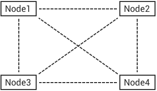

# EMQX 手动配置管理集群


## 集群原理
Erlang/OTP 语言平台的分布式程序，由分布互联的 Erlang 运行系统组成，每个 Erlang 运行系统被称为节点(Node)，节点(Node) 间通过 TCP 互联，消息传递的方式通信:



### 节点(Node)
Erlang 节点由唯一的节点名称标识，节点间通过名称进行通信寻址。

### 搭建集群
假设部署两台服务器 emqx@172.16.0.10, emqx@172.16.0.20 上部署集群:

| 节点名      | 主机名(FQDN) | IP 地址 |
| ----------- | ----------- |----------- |
| emqx@172.16.0.10   |  node1      | 172.16.0.10       |
| emqx@172.16.0.20   |  node2      | 172.16.0.20       |

> 节点名格式: Name@Host, Host 必须是 IP 地址或 FQDN(主机名.域名)

#### 安装EMQX节点

1. 下载地址 https://www.emqx.io/downloads/broker/v4.1.0/
2. 节点设置
```bash
分别设置 emqx/etc/emqx.conf的node.name
比如: node.name = emqx@172.16.0.10
```
3. 启动节点
```bash
./bin/emqx start
```

4. 手动加入节点
```bash
./bin/emqx_ctl cluster join emqx@172.16.0.20

# 查看集群状态
./bin/emqx_ctl cluster status
```

5. 发布&订阅
```bash
# 发布
cd mqtt/publish && ./publish

# 订阅
cd mqtt/subscribe && ./subscribe
```
